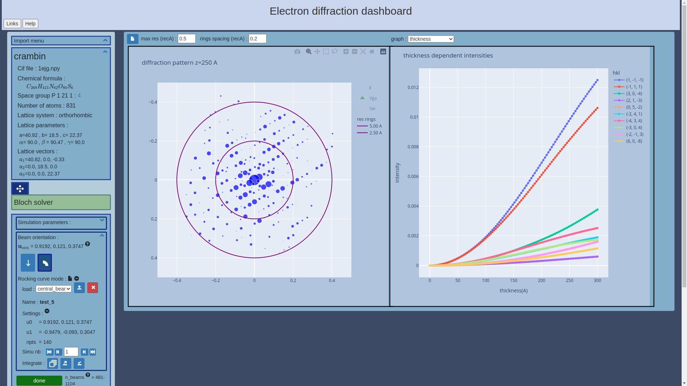

# edly
Electron diffraction simulator web dashboard.



## Installation
Run the `install.sh` file to complete installation.

## Miscellaneous
### datasets
Experimental dataset (raw frames) are located in the `database` folder. Locally available datasets can manually be put in this directory.

### Clear a session info
Automatically cleared every day but can also be cleared manually with :
```
rm -rf static/data/tmp/<session_id>
```
